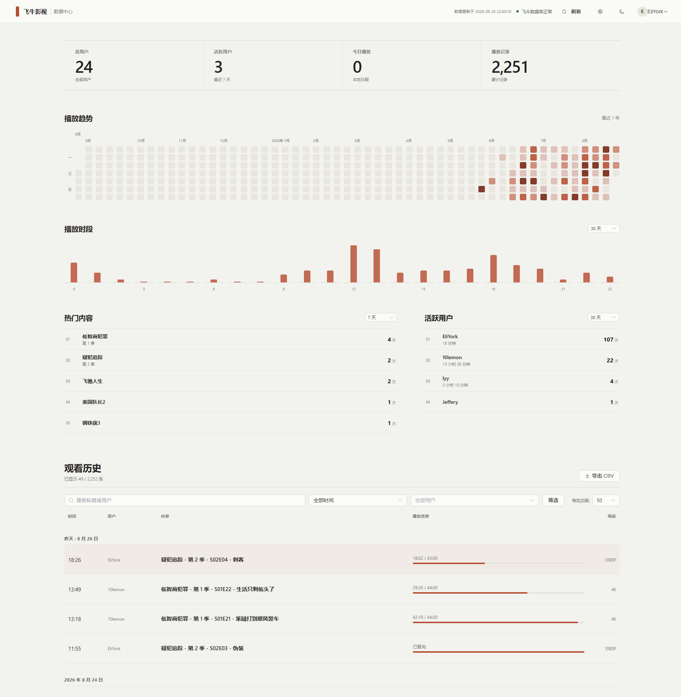

# fntv-admin

`fntv-admin` 是从零开发的飞牛影视增强管理后台。项目官方只支持 Docker Compose 部署，生产环境优先使用一个容器运行 FastAPI 后端和 Vue 构建后的静态前端。

飞牛 NAS 默认推荐直接拉取 Docker Hub 成品镜像运行，不推荐在飞牛本机 build 镜像。GHCR 作为备用镜像源。

## 界面预览



核心边界：

- Docker Compose 是唯一官方部署入口。
- 默认部署使用 Docker Hub 成品镜像。
- GHCR 仅作为备用镜像源。
- 飞牛影视数据库目录挂载到 `/fntv`，应用代码层只读打开 `/fntv/trimmedia.db`。
- 所有增强数据写入 `/data/admin.db`。
- 默认本地和外部访问都需要登录；可在系统设置中开启本地免登录，外部访问仍需登录或可禁止。
- 所有可变数据都保存在 `/data`。
- 不提供裸机、PM2、手动 Nginx、宝塔或 systemd 生产部署方式。

## 快速开始

1. 复制 `docker-compose.yml` 到飞牛 NAS 的应用目录。

2. 确认镜像地址。官方默认示例使用 `docker.io/eliyork/fntv-admin:latest`：

```yaml
services:
  fntv-admin:
    # 默认源: Docker Hub.
    # 备用源: ghcr.io/eliyork/fntv-admin:latest
    image: docker.io/eliyork/fntv-admin:latest
    container_name: fntv-admin
    restart: unless-stopped

    ports:
      - "${FNTV_ADMIN_PORT:-18080}:8080"

    volumes:
      # 后台数据目录，需读写
      - ./data:/data

      # 飞牛影视数据库目录，不加 :ro；应用层仍只读访问
      - /usr/local/apps/@appdata/trim.media/database:/fntv

    environment:
      APP_ENV: production
      TZ: Asia/Shanghai

      FNTV_DB_PATH: /fntv/trimmedia.db
      ADMIN_DB_PATH: /data/admin.db
      LOG_DIR: /data/logs
      CACHE_DIR: /data/cache
      BACKUP_DIR: /data/backup
      DEFAULT_PAGE_SIZE: "20"
      LOG_RETENTION_DAYS: "14"
      TRUST_PROXY_HEADERS: "false"
      TRUSTED_PROXIES: ""
      SNAPSHOT_ENABLED: "true"
      SNAPSHOT_REFRESH_INTERVAL_SECONDS: "900"
      ACTIVE_WATCH_WINDOW_SECONDS: "300"
```

3. 检查挂载路径：

```text
飞牛影视数据库目录：/usr/local/apps/@appdata/trim.media/database -> /fntv
fntv-admin 数据目录：./data -> /data 读写
```

`FNTV_DB_PATH` 保持 `/fntv/trimmedia.db`。不要把飞牛影视数据库目录挂到 `/data`。

4. 启动：

```bash
docker compose up -d
```

5. 打开：

```text
http://localhost:18080
```

在飞牛 NAS 上访问时，把 `localhost` 换成飞牛 IP：

```text
http://飞牛IP:18080
```

默认宿主机端口为 `18080`，容器内部仍监听 `8080`。如需避开其他服务，可在 `.env` 中设置 `FNTV_ADMIN_PORT`（例如测试实例使用 `18081`），无需修改容器端口。

首次进入时直接在页面创建管理员账号，只需填写用户名和密码，不需要终端或额外部署步骤。管理员密码只会以 hash 形式写入 `/data/admin.db`。首次安装建议先通过可信局域网访问 NAS 地址完成管理员创建，再配置公网映射或反向代理；尚未创建管理员的实例不要直接暴露到不可信网络。

未显式设置 `APP_SECRET_KEY` 时，应用会在 `/data/admin.db` 的独立内部密钥表中自动生成并持久化强随机 JWT 密钥（不会通过设置 API 返回）。也可以通过环境变量提供至少 32 个字符的随机密钥；公开占位值和过短密钥不会被用于签名。

## 访问控制

登录系统不会被删除。默认策略是：

```text
本地访问：需要登录
外部访问：需要登录
TRUST_PROXY_HEADERS=false
```

系统设置页提供“访问控制”区域，可分别设置本地访问为“需要登录 / 免登录”，外部访问为“需要登录 / 禁止访问”。本地免登录仅适合可信飞牛内网使用；外部访问设置为“禁止访问”时，非本地来源会直接返回 403。

本地来源包括 `127.0.0.1`、`::1`、`10.0.0.0/8`、`172.16.0.0/12`、`192.168.0.0/16`、`fc00::/7`、`fe80::/10`。如果通过公网、DDNS 或反向代理访问，建议保持本地和外部都需要登录，或将外部访问设为禁止。

默认不信任 `Forwarded` / `X-Forwarded-For` / `X-Real-IP`。通过反向代理并需要区分本地与外部来源时，必须同时设置 `TRUST_PROXY_HEADERS=true` 和 `TRUSTED_PROXIES`（逗号分隔的代理 IP/CIDR，例如 `127.0.0.1/32,172.18.0.0/16`）。只有直接 TCP peer 命中可信代理范围时才解析代理链；其他客户端提供的代理头会被拒绝用于本地免登录判断。代理本身也必须覆盖或正确追加来源头，来源不确定时应用会要求登录。

## 镜像地址

默认 Docker Hub 镜像：

```text
docker.io/eliyork/fntv-admin:latest
docker.io/eliyork/fntv-admin:vX.Y.Z
```

备用 GHCR 镜像：

```text
ghcr.io/eliyork/fntv-admin:latest
ghcr.io/eliyork/fntv-admin:vX.Y.Z
```

GitHub Actions 的镜像职责：

- push 到 `develop`：构建 Docker Hub / GHCR 的 `dev` 镜像。
- push 到 `main`：构建 Docker Hub / GHCR 的 `latest` 镜像。
- 正式 Release workflow：校验 `main` 来源后构建 Docker Hub / GHCR 的 `vX.Y.Z` 镜像，并创建 GitHub Release。

如果 fork 后要发布自己的镜像，可以把示例中的 `eliyork` 改成自己的账号；官方默认示例保持 `eliyork`。

GHCR 镜像名格式：

```text
ghcr.io/eliyork/fntv-admin:latest
ghcr.io/eliyork/fntv-admin:dev
ghcr.io/eliyork/fntv-admin:vX.Y.Z
```

正式发布前，先由用户在 NAS 上验收 `dev`，再将 `develop` 合并到 `main`。随后在 GitHub Actions 中选择 `main` 运行 Release workflow，输入严格格式的版本号（例如 `v0.8.1`）。流水线会创建不可变 tag、推送两个镜像源的版本镜像、生成版本锁定 Compose 与 `SHA256SUMS.txt`，最后创建 GitHub Release。用户本人直接向 GitHub push 一个合法且属于 `main` 历史的 `vX.Y.Z` tag 时，也会执行相同流程。

## 数据持久化

容器内固定路径：

```text
/fntv/trimmedia.db    飞牛影视数据库，由 /fntv 目录挂载提供，应用代码层只读打开
/data/admin.db        fntv-admin 增强数据
/data/logs            运行日志
/data/cache           缓存
/data/backup          备份
```

只要 `/data` 保留，删除并重建容器不会丢失后台配置、备注、隐藏状态、认证策略和快照设置。

## 飞牛数据库只读保护

`docker-compose.yml` 默认包含：

```yaml
- /usr/local/apps/@appdata/trim.media/database:/fntv
```

飞牛影视实机可能使用 SQLite WAL 模式。Docker 层给 `/fntv` 加 `:ro` 时，SQLite 可能因为无法访问或维护 `-wal`、`-shm`、锁相关文件而报 `unable to open database file`。因此飞牛默认 Compose 不再给 `/fntv` 写 `:ro`。

`/data` 必须读写挂载，否则 `admin.db`、日志和缓存无法持久化。飞牛数据库的安全边界由应用代码层保证：后端通过 SQLite URI `mode=ro` 打开飞牛数据库，并在连接上设置 `PRAGMA query_only = ON`。业务代码不提供任何飞牛数据库写入接口，`python scripts/verify_fntv_readonly.py` 必须通过。

## 飞牛源库直读与可选快照

默认直接只读读取 `/fntv/trimmedia.db`。后端使用 SQLite URI `mode=ro` 打开源库，并设置 `PRAGMA query_only = ON`。即使飞牛 Docker UI 中显示数据库目录不是只读挂载，代码层仍会拒绝写入飞牛数据库。

Phase 7C 增加快照读取。全新安装默认 `SNAPSHOT_ENABLED=true`，后端会尝试用 SQLite backup API 生成 `/data/cache/trimmedia.snapshot.db`，业务查询优先读取快照；如果快照生成或打开失败，会自动回退源库只读直连，系统诊断页显示失败原因和 `fallback_to_source`。`admin.db` 中已保存的开关与刷新间隔始终优先，不会在升级时被默认值覆盖。

快照采用 TTL 懒刷新，不是独立定时任务：打开页面或停留在页面时自动检查，距上次成功刷新超过间隔才重建快照（默认 15 分钟，`SNAPSHOT_REFRESH_INTERVAL_SECONDS=900`；系统设置中可改为 30 分钟 / 1 小时 / 6 小时 / 24 小时，设为 `0` 则关闭自动刷新、仅手动刷新）。自动与手动刷新共用同一并发门控；刷新期间读取不会等待，可继续使用旧快照或源库只读直连。刷新失败会按最近一次尝试时间抑制重复重试，并自动回退源库直读。

快照只写入 `/data/cache`，不复制 `.wal/.shm` 作为主要方案，不写飞牛影视数据库，不改变 `/fntv` 挂载语义。

## 开发者本地构建

以下命令仅用于开发者本地测试，不是官方生产部署方式，也不是飞牛可视化部署默认路径：

```bash
docker compose -f docker-compose.build.yml build
docker compose -f docker-compose.build.yml up -d
```

## 飞牛可视化部署

飞牛 Docker 可视化界面部署步骤见 [docs/FNOS_GUI_DEPLOY.md](docs/FNOS_GUI_DEPLOY.md)。

## 当前阶段

当前实现已覆盖以下基础后台能力：

- Docker Compose-first 项目结构。
- FastAPI 后端与 Vue 前端。
- 单容器生产 Dockerfile。
- Docker Hub 为默认成品镜像源，GHCR 作为备用发布目标。
- 启动检查、健康检查、数据库状态。
- 首次管理员初始化、登录、退出、当前用户、修改密码。
- 后台采用单页数据中心布局，通过顶部状态栏集中展示系统状态，并提供浅色、深色主题；数据中心展示总览指标、最近活跃观看、播放时段、观看历史、热门内容、收藏记录和下载记录简版。
- 观看历史、用户管理、媒体库基础 API 与页面。
- 观看历史支持分页、搜索、CSV 导出和播放进度条展示；显式 `watched/completed` 完成标记优先于 position，已看完但 position 归零的记录显示“已看完”；飞牛 `item.runtime` 小整数按分钟归一化，避免 44 分钟被显示成 44 秒。
- 用户管理支持搜索、隐藏用户和后端全量表头排序；点击标题整体切换升降序。
- 媒体库优化剧集/季/单集标题展示，避免重复拼接；隐藏操作写入 `admin.db`。
- 数据中心复用报表 API 提供总览、播放趋势、活跃用户榜、热门媒体榜等统计能力；独立报表中心页面已移除，旧 `/reports` 链接兼容重定向到 `/dashboard`。
- Phase 7C 增加播放时段分布、收藏记录只读列表、下载记录只读诊断、最近活跃观看推断、观看历史时间范围筛选和增强 CSV 导出。
- 最近活跃观看使用最近 5 分钟播放记录更新时间推断，不是真正实时 session。
- 系统诊断显示快照状态、新增表能力和 `watched` 字段取值诊断；诊断不返回真实播放记录行。
- 系统设置支持主题、本地访问认证策略和外部访问认证策略；系统诊断页提供飞牛数据库状态、schema 诊断、只读状态和右上角复制诊断信息。

飞牛数据库表结构不确定时，页面会显示空状态或数据库异常提示，不会导致应用崩溃。

数据中心通过后端 report API 和 SQL 聚合只读统计当前 active 数据库；默认优先使用按需刷新的快照，失败会自动回退源库只读直连。增强配置、账号和后续缓存类数据只允许写入 `/data/admin.db`。

## 特别感谢 / 参考项目

本项目从零开发，不 fork、不复制以下项目的代码、结构、资源或样式；开发过程中仅参考了公开项目在交互展示、数据口径和只读管理思路上的经验：

- fntv-record-view：飞牛影视观看记录展示、字段口径参考。
- [fnmedia-monitor](https://github.com/deepvoce/fnmedia-monitor)：飞牛影视监控面板、播放时段、下载/收藏/最近活跃观看等只读数据展示思路参考。
- fntv-electron：飞牛影视桌面端封装思路参考。
- fnos-tv：基于飞牛影视接口的网页端实现参考。

## License

本项目采用 [MIT License](LICENSE)。

第三方项目、依赖和素材版权归原作者所有，以其原项目 License 为准。
